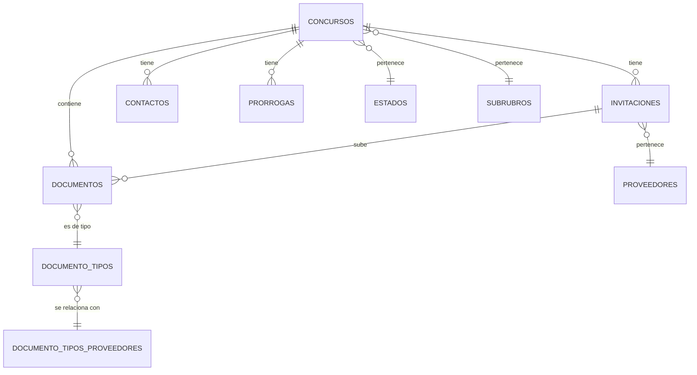

# Especificaciones Técnicas - API de Concursos

Este documento contiene las especificaciones técnicas detalladas para implementar la API de concursos en otro sistema basándose en los lineamientos establecidos.

---

## 1. Arquitectura del Sistema

### 1.1. Estructura de Base de Datos

#### Tabla: `concursos`
```sql
CREATE TABLE concursos (
    id BIGINT UNSIGNED PRIMARY KEY AUTO_INCREMENT,
    nombre VARCHAR(255) NOT NULL,
    numero BIGINT UNSIGNED NULL,
    descripcion TEXT NOT NULL,
    fecha_inicio DATETIME NOT NULL,
    fecha_cierre DATETIME NOT NULL,
    numero_legajo VARCHAR(255) NOT NULL,
    legajo VARCHAR(255) NOT NULL,
    estado_id BIGINT UNSIGNED NOT NULL DEFAULT 1,
    subrubro_id BIGINT UNSIGNED NULL,
    user_id BIGINT UNSIGNED NULL,
    created_at TIMESTAMP NULL DEFAULT NULL,
    updated_at TIMESTAMP NULL DEFAULT NULL,
    
    FOREIGN KEY (estado_id) REFERENCES estados(id) ON DELETE CASCADE,
    FOREIGN KEY (subrubro_id) REFERENCES subrubros(id),
    FOREIGN KEY (user_id) REFERENCES users(id)
);
```

#### Tabla: `invitacions`
```sql
CREATE TABLE invitacions (
    id BIGINT UNSIGNED PRIMARY KEY AUTO_INCREMENT,
    concurso_id BIGINT UNSIGNED NOT NULL,
    proveedor_id BIGINT UNSIGNED NOT NULL,
    intencion TINYINT UNSIGNED DEFAULT 0,
    fecha_envio DATE NULL,
    created_at TIMESTAMP NULL DEFAULT NULL,
    updated_at TIMESTAMP NULL DEFAULT NULL,
    
    FOREIGN KEY (concurso_id) REFERENCES concursos(id) ON DELETE CASCADE,
    INDEX idx_proveedor_id (proveedor_id)
);
```

#### Tabla: `documento_tipos`
```sql
CREATE TABLE documento_tipos (
    id BIGINT UNSIGNED PRIMARY KEY AUTO_INCREMENT,
    nombre VARCHAR(255) NOT NULL,
    descripcion TEXT NULL,
    de_concurso BOOLEAN DEFAULT TRUE,
    encriptado BOOLEAN DEFAULT FALSE,
    obligatorio BOOLEAN DEFAULT FALSE,
    tipo_documento_proveedor_id BIGINT UNSIGNED NULL,
    created_at TIMESTAMP NULL DEFAULT NULL,
    updated_at TIMESTAMP NULL DEFAULT NULL
);
```

#### Tabla: `documentos`
```sql
CREATE TABLE documentos (
    id BIGINT UNSIGNED PRIMARY KEY AUTO_INCREMENT,
    concurso_id BIGINT UNSIGNED NULL,
    invitacion_id BIGINT UNSIGNED NULL,
    documento_tipo_id BIGINT UNSIGNED NULL,
    archivo VARCHAR(255) NULL,
    mimeType VARCHAR(100) NULL,
    extension VARCHAR(10) NULL,
    file_storage VARCHAR(500) NULL,
    encriptado BOOLEAN DEFAULT FALSE,
    user_id_created BIGINT UNSIGNED NULL,
    created_at TIMESTAMP NULL DEFAULT NULL,
    updated_at TIMESTAMP NULL DEFAULT NULL,
    
    FOREIGN KEY (concurso_id) REFERENCES concursos(id) ON DELETE CASCADE,
    FOREIGN KEY (invitacion_id) REFERENCES invitacions(id) ON DELETE CASCADE,
    FOREIGN KEY (documento_tipo_id) REFERENCES documento_tipos(id) ON DELETE SET NULL
);
```

#### Tabla: `estados`
```sql
CREATE TABLE estados (
    id BIGINT UNSIGNED PRIMARY KEY AUTO_INCREMENT,
    nombre VARCHAR(100) NOT NULL,
    created_at TIMESTAMP NULL DEFAULT NULL,
    updated_at TIMESTAMP NULL DEFAULT NULL
);
```

#### Tabla: `contactos`
```sql
CREATE TABLE contactos (
    id BIGINT UNSIGNED PRIMARY KEY AUTO_INCREMENT,
    concurso_id BIGINT UNSIGNED NOT NULL,
    tipo VARCHAR(100) NULL,
    nombre VARCHAR(255) NOT NULL,
    email VARCHAR(255) NULL,
    telefono VARCHAR(50) NULL,
    created_at TIMESTAMP NULL DEFAULT NULL,
    updated_at TIMESTAMP NULL DEFAULT NULL,
    
    FOREIGN KEY (concurso_id) REFERENCES concursos(id) ON DELETE CASCADE
);
```

#### Tabla: `prorrogas`
```sql
CREATE TABLE prorrogas (
    id BIGINT UNSIGNED PRIMARY KEY AUTO_INCREMENT,
    concurso_id BIGINT UNSIGNED NOT NULL,
    fecha_anterior DATETIME NOT NULL,
    fecha_nueva DATETIME NOT NULL,
    motivo TEXT NULL,
    created_at TIMESTAMP NULL DEFAULT NULL,
    updated_at TIMESTAMP NULL DEFAULT NULL,
    
    FOREIGN KEY (concurso_id) REFERENCES concursos(id) ON DELETE CASCADE
);
```

### 1.2. Relaciones entre Tablas



---

## 2. Modelos y Relaciones

### 2.1. Modelo Concurso
```php
class Concurso extends Model
{
    protected $casts = [
        'fecha_inicio' => 'datetime',
        'fecha_cierre' => 'datetime',
    ];

    public function invitaciones()
    {
        return $this->hasMany(Invitacion::class);
    }

    public function estado()
    {
        return $this->belongsTo(Estado::class);
    }

    public function subrubro()
    {
        return $this->belongsTo(Subrubro::class);
    }

    public function documentos()
    {
        return $this->hasMany(Documento::class);
    }

    public function contactos()
    {
        return $this->hasMany(Contacto::class);
    }

    public function prorrogas()
    {
        return $this->hasMany(Prorroga::class);
    }

    public function documentos_requeridos()
    {
        return $this->belongsToMany(DocumentoTipo::class, 'concurso_documento_tipo');
    }

    public function getEstadoActualAttribute()
    {
        $mapeoEstados = [
            1 => 'precarga',
            2 => 'activo',
            3 => 'analisis',
            4 => 'terminado',
            5 => 'anulado'
        ];
        
        $estadoId = $this->estado->id;
        
        if ($estadoId == 2 && $this->fecha_cierre->isPast()) {
            return 'cerrado';
        }
        
        return $mapeoEstados[$estadoId] ?? 'desconocido';
    }
}
```

### 2.2. Modelo Invitacion
```php
class Invitacion extends Model
{
    protected $casts = [
        'fecha_envio' => 'date',
    ];

    public function concurso()
    {
        return $this->belongsTo(Concurso::class);
    }

    public function proveedor()
    {
        return $this->belongsTo(Proveedor::class);
    }

    public function documentos()
    {
        return $this->hasMany(Documento::class);
    }
}
```

### 2.3. Modelo Documento
```php
class Documento extends Model implements HasMedia
{
    use InteractsWithMedia;

    protected $casts = [
        'encriptado' => 'boolean',
    ];

    public function concurso()
    {
        return $this->belongsTo(Concurso::class);
    }

    public function invitacion()
    {
        return $this->belongsTo(Invitacion::class);
    }

    public function documentoTipo()
    {
        return $this->belongsTo(DocumentoTipo::class);
    }

    public function registerMediaCollections(): void
    {
        $this->addMediaCollection('archivos')->useDisk('concursos');
    }
}
```

---

## 3. Autenticación y Autorización

### 3.1. Middleware JWT
```php
class VerifyJWT
{
    public function handle($request, Closure $next)
    {
        try {
            $token = $request->bearerToken();
            if (!$token) {
                throw new \Exception('Token no proporcionado');
            }

            $decoded = JWT::decode($token, new Key(env('JWT_SECRET'), 'HS256'));
            $request->attributes->add(['proveedor_id' => $decoded->sub]);

            return $next($request);
        } catch (\Exception $e) {
            return response()->json(['error' => 'Token inválido: ' . $e->getMessage()], 401);
        }
    }
}
```

### 3.2. Generación de Token
```php
public function generateToken(Request $request)
{
    $cuit = $request->input('cuit');
    $email = $request->input('email');
    
    $proveedor = Proveedor::where('cuit', $cuit)->where('correo', $email)->first();
    
    if (!$proveedor) {
        return response()->json(['error' => 'Proveedor no encontrado'], 404);
    }
    
    $token = JWT::encode([
        'sub' => $proveedor->id,
        'cuit' => $cuit,
        'email' => $email,
        'iat' => time(),
        'exp' => time() + 600 // 10 minutos
    ], env('JWT_SECRET'), 'HS256');
    
    return response()->json(['token' => $token]);
}
```

---

## 4. Recursos API (Resources)

### 4.1. ConcursoResource
```php
class ConcursoResource extends JsonResource
{
    public function toArray($request)
    {
        return [
            'id' => $this->id,
            'nombre' => $this->nombre,
            'numero' => $this->numero,
            'descripcion' => $this->descripcion,
            'fecha_inicio' => $this->fecha_inicio?->format('Y-m-d H:i:s'),
            'fecha_cierre' => $this->fecha_cierre?->format('Y-m-d H:i:s'),
            'numero_legajo' => $this->numero_legajo,
            'legajo' => $this->legajo,
            'estado' => [
                'id' => $this->estado?->id,
                'nombre' => $this->estado?->nombre,
                'estado_actual' => $this->estado_actual
            ],
            'subrubro' => [
                'id' => $this->subrubro?->id,
                'nombre' => $this->subrubro?->nombre,
                'rubro' => [
                    'id' => $this->subrubro?->rubro?->id,
                    'nombre' => $this->subrubro?->rubro?->nombre
                ]
            ],
            'contactos' => ContactoConcursoResource::collection($this->whenLoaded('contactos')),
            'sedes' => SedeResource::collection($this->whenLoaded('sedes')),
            'prorrogas' => ProrrogaResource::collection($this->whenLoaded('prorrogas')),
            'documentos' => DocumentoConcursoResource::collection($this->whenLoaded('documentos')),
            'documentos_requeridos' => DocumentoTipoResource::collection($this->whenLoaded('documentos_requeridos')),
            'invitacion' => new InvitacionResource($this->whenLoaded('invitaciones')->first()),
            'created_at' => $this->created_at?->format('Y-m-d H:i:s'),
            'updated_at' => $this->updated_at?->format('Y-m-d H:i:s'),
        ];
    }
}
```

---

## 5. Validación de Datos

### 5.1. Request para Cambiar Intención
```php
class ConcursoCambiarIntencionRequest extends FormRequest
{
    public function rules(): array
    {
        return [
            'intencion' => 'required|integer|in:0,1,2,3',
        ];
    }

    public function messages(): array
    {
        return [
            'intencion.required' => 'La intención es requerida.',
            'intencion.integer' => 'La intención debe ser un número entero.',
            'intencion.in' => 'La intención debe ser: 0 (Pregunta), 1 (Participa), 2 (No participa), 3 (Ofertó).',
        ];
    }
}
```

### 5.2. Request para Subir Documento
```php
class ConcursoSubirDocumentoRequest extends FormRequest
{
    public function rules(): array
    {
        return [
            'documento_tipo_id' => 'required|exists:concursos.documento_tipos,id',
            'file' => 'required|file|max:10240', // 10MB
        ];
    }
}
```

---

## 6. Gestión de Archivos

### 6.1. Configuración de Disco
```php
// config/filesystems.php
'disks' => [
    'concursos' => [
        'driver' => 'local',
        'root' => storage_path('app/concursos'),
        'url' => env('APP_URL').'/storage/concursos',
        'visibility' => 'private',
    ],
],
```

### 6.2. Subida de Archivos
```php
public function subirDocumento(ConcursoSubirDocumentoRequest $request, $concurso_id)
{
    $proveedor_id = $request->attributes->get('proveedor_id');
    $invitacion = Invitacion::where('concurso_id', $concurso_id)
        ->where('proveedor_id', $proveedor_id)
        ->firstOrFail();
    
    DB::beginTransaction();
    try {
        $documento = new Documento([
            'concurso_id' => $concurso_id,
            'invitacion_id' => $invitacion->id,
            'documento_tipo_id' => $request->documento_tipo_id,
            'user_id_created' => null,
        ]);
        $documento->save();
        
        if ($request->hasFile('file')) {
            $media = $documento->addMediaFromRequest('file')
                ->usingFileName($request->file('file')->getClientOriginalName())
                ->toMediaCollection('archivos');
            
            $documento->archivo = $media->file_name;
            $documento->mimeType = $media->mime_type;
            $documento->extension = $media->getExtensionAttribute();
            $documento->file_storage = $media->getPath();
            $documento->save();
        }
        
        DB::commit();
        return response()->json([
            'success' => true,
            'data' => new DocumentoConcursoResource($documento->load('documentoTipo')),
            'message' => 'Documento subido correctamente. Pendiente de validación.'
        ]);
    } catch (\Exception $e) {
        DB::rollBack();
        return response()->json([
            'success' => false,
            'message' => 'Error al subir el documento: ' . $e->getMessage()
        ], 500);
    }
}
```

### 6.3. Descarga de Archivos
```php
public function descargarDocumento(Request $request, $concurso_id, $documento_id)
{
    $proveedor_id = $request->attributes->get('proveedor_id');
    
    $invitacion = Invitacion::where('concurso_id', $concurso_id)
        ->where('proveedor_id', $proveedor_id)
        ->firstOrFail();
    
    $documento = Documento::where('id', $documento_id)
        ->where('concurso_id', $concurso_id)
        ->firstOrFail();
    
    if (!$documento->getFirstMedia('archivos')) {
        return response()->json([
            'success' => false,
            'message' => 'El documento no tiene archivo asociado.'
        ], 404);
    }
    
    $media = $documento->getFirstMedia('archivos');
    $path = $media->getPath();
    
    if (!Storage::disk('concursos')->exists($path)) {
        return response()->json([
            'success' => false,
            'message' => 'El archivo no existe en el servidor.'
        ], 404);
    }
    
    return response()->download(Storage::disk('concursos')->path($path), $media->file_name);
}
```

---

## 7. Rutas API

```php
// Endpoints protegidos por JWT
Route::middleware('verify.jwt')->group(function () {
    // CONCURSOS
    Route::get('/concursos', [ConcursoController::class, 'index']);
    Route::get('/concursos/tipos-documentos', [ConcursoController::class, 'tiposDocumentos']);
    Route::get('/concursos/{concurso_id}', [ConcursoController::class, 'show']);
    Route::patch('/concursos/{concurso_id}/invitacion', [ConcursoController::class, 'cambiarIntencion']);
    Route::post('/concursos/{concurso_id}/documentos', [ConcursoController::class, 'subirDocumento']);
    Route::get('/concursos/{concurso_id}/documentos', [ConcursoController::class, 'documentosInvitacion']);
    Route::get('/concursos/{concurso_id}/documentos/{documento_id}/descargar', [ConcursoController::class, 'descargarDocumento']);
    Route::get('/concursos/{concurso_id}/documentos/{documento_tipo_id}/verificar', [ConcursoController::class, 'verificarDocumentoProveedor']);
});
```

---

## 8. Dependencias Requeridas

### 8.1. Composer
```json
{
    "require": {
        "firebase/php-jwt": "^6.0",
        "spatie/laravel-medialibrary": "^10.0",
        "laravel/framework": "^10.0"
    }
}
```

### 8.2. Variables de Entorno
```env
JWT_SECRET=tu_clave_secreta_muy_segura
JWT_TTL=600
```

---

## 9. Consideraciones de Seguridad

1. **Autenticación JWT**: Tokens con expiración de 10 minutos
2. **Validación de Acceso**: Verificar que el proveedor tenga invitación al concurso
3. **Validación de Archivos**: Límite de tamaño y tipos MIME permitidos
4. **Rate Limiting**: Implementar límites de requests por minuto
5. **Logs de Auditoría**: Registrar todas las acciones importantes
6. **Encriptación**: Soporte para documentos encriptados
7. **CORS**: Configurar adecuadamente para el dominio del frontend

---

## 10. Testing

### 10.1. Tests Unitarios
```php
class ConcursoControllerTest extends TestCase
{
    use RefreshDatabase;

    public function test_puede_listar_concursos_del_proveedor()
    {
        $proveedor = Proveedor::factory()->create();
        $concurso = Concurso::factory()->create();
        $invitacion = Invitacion::factory()->create([
            'concurso_id' => $concurso->id,
            'proveedor_id' => $proveedor->id
        ]);

        $token = $this->generateToken($proveedor);
        
        $response = $this->withHeaders(['Authorization' => 'Bearer ' . $token])
            ->get('/api/concursos');

        $response->assertStatus(200)
            ->assertJsonStructure([
                'success',
                'data' => [
                    '*' => [
                        'id',
                        'nombre',
                        'estado',
                        'invitacion'
                    ]
                ],
                'message'
            ]);
    }
}
```

---

## 11. Monitoreo y Logs

### 11.1. Logs de Actividad
```php
Log::info('Documento subido', [
    'proveedor_id' => $proveedor_id,
    'concurso_id' => $concurso_id,
    'documento_id' => $documento->id,
    'tipo' => $documento->documentoTipo->nombre
]);
```

### 11.2. Métricas
- Número de concursos activos
- Documentos subidos por día
- Tiempo de respuesta promedio
- Errores por endpoint

---

## 12. Documentación Adicional

- [API de Concursos - Documentación Completa](API_CONCURSOS_COMPLETA.md)
- [Guía de Implementación](GUIA_IMPLEMENTACION.md)
- [Ejemplos de Uso](EJEMPLOS_USO.md) 